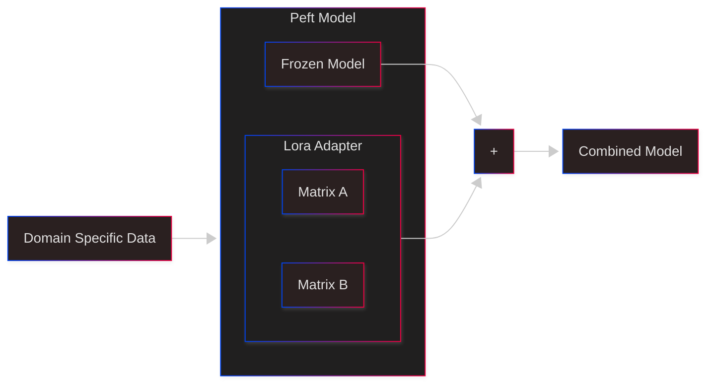

# Fine Tune LLM

## Introduction

Assume that you built a kickass AI application using a large language model (LLM) like GPT-4 or LLaMA. You showed it to your teammates, your manager, your client. Everyone is happy. You get the go ahead to deploy it to production.

After 1 month, your client comes back to you. He is not happy with the cost of running the application. The inference cost is too high. Instead of saving cost, the application is costing more money than before. He wants you to reduce the cost of running the application.
You think to yourself, "Hmm, maybe I can fine-tune a smaller model on my specific use case. That should reduce the inference cost significantly". You replace the model, test it with some use cases, and the results were satisfactory. Your client is happy again. You get the go ahead to deploy the model to production.

After 3 months, your client comes back to you again. This time, he is not happy with the quality of the responses from the model. The model is not able to handle some specific queries related to his domain. He wants you to improve the quality of the responses. You think to yourself, "Hmm, maybe I can fine-tune the model further on more specific data related to his domain". You gather more data, fine-tune the model again, test it with some use cases, and the results were satisfactory. Your client is happy again. You get the go ahead to deploy the model to production.

Above is an example of how fine-tuning can help improve the performance and reduce the cost of running an AI application. Fine-tuning allows you to adapt a pre-trained model to your specific use case, making it more efficient and effective. In the following sections, we will explore how to fine-tune large language models (LLMs). We will also discuss how to deploy the fine-tuned models using AWS SageMaker.

## What exactly is Fine-Tuning?


Fine-tuning is the process of taking a pre-trained model and training it further on a specific dataset to adapt it to a particular task or domain. This involves updating the model's weights based on the new data while retaining the knowledge learned during the initial pre-training phase. Fine-tuning can be done using various techniques, such as full model fine-tuning, parameter-efficient fine-tuning (PEFT) which further includes methods like LoRA (Low-Rank Adaptation), and adapter-based fine-tuning.

## Comparison with RAG


You might be wondering, "Is fine tuning the only way to adapt LLMs to specific tasks? Is there any other simpler way?" The answer is yes. Another popular approach is Retrieval-Augmented Generation (RAG). RAG combines pre-trained language models with external knowledge sources, such as databases or document collections, to enhance the model's ability to generate relevant and accurate responses. Instead of fine-tuning the entire model, RAG retrieves relevant information from the external source and incorporates it into the generation process.

But here is the minor observation, Although RAG is simpler and preferable in many scenarios, it may not always be sufficient for highly specialized tasks that require deep domain knowledge or specific language patterns. Sometime you might want the model to reply in a specific way that is only possible through fine-tuning. In such cases, fine-tuning becomes necessary to achieve the desired performance.

The ideal approach often involves a combination of both fine-tuning and RAG, where the model is fine-tuned on a smaller, domain-specific dataset while also leveraging external knowledge sources for enhanced performance. This again leads to multiple issues, like need for using and maintaining multiple systems, increased complexity, etc. So, it is always a trade-off between simplicity and performance.

## Types of Fine-Tuning Techniques

There are several techniques for fine-tuning large language models, each with its own advantages and disadvantages. Some of the most common techniques include:

### Full Model Fine-Tuning

Involves updating all the parameters of the pre-trained model. This approach can lead to better performance but requires significant computational resources and large amounts of labeled data.
In this case all the weights of the model are updated during training. The disadvantage of this approach is that it is computationally expensive and requires a lot of memory. It can also lead to overfitting if the dataset is small. It can also lead to catastrophic forgetting, where the model forgets the knowledge it learned during pre-training.

### Parameter-Efficient Fine-Tuning (PEFT)

Involves updating only a small subset of the model's parameters, making it more efficient in terms of computation and memory usage. Techniques like LoRA (Low-Rank Adaptation) fall under this category. PEFT methods are particularly useful when dealing with large models and limited computational resources. They allow for faster training times and reduced memory consumption while still achieving good performance on specific tasks.

PEFT is futher divided into multiple techniques like LoRA, Adapters, Prefix Tuning, etc. Among these, LoRA has gained significant popularity due to its simplicity and effectiveness. LoRA works by introducing low-rank matrices into the model's architecture, allowing for efficient adaptation without modifying the original weights extensively.

## LoRA (Low-Rank Adaptation)




LoRA is a parameter-efficient fine-tuning technique that introduces low-rank matrices into the model's architecture. Instead of updating all the weights of the model during fine-tuning, LoRA adds trainable low-rank matrices to certain layers of the model. During training, only these low-rank matrices are updated, while the original weights remain frozen. This significantly reduces the number of parameters that need to be updated, making the fine-tuning process more efficient.

The research paper introducing LoRA can be found [here](https://arxiv.org/abs/2106.09685).

## Let's Fine-Tune a Model

In this blog, we will focus on PEFT using LoRA due to its efficiency and effectiveness for many use cases.

We will use Qwen/Qwen1.5-0.5B-Chat model from Qwen series by Alibaba for demonstration purposes. However, the same concepts can be applied to other LLMs like GPT, LLaMA, etc. We will fine-tune it on counsel chat dataset from Huggingface which contains mental health related questions and answers.  
Basically we will build a mental health chatbot using fine-tuned Qwen model. Note that this is just for demonstration purposes. In real world, mental health related applications should be built with extreme caution and after consulting domain experts.

The full code for this notebook is available [here](https://github.com/your-repo/your-notebook).

## Step 1: Load the Dataset

We will use counsel chat dataset from Huggingface which contains mental health related questions and answers. You can load the dataset using the following code. The dataset is available [here](https://huggingface.co/datasets/counselchat/counselchat).

## Step 2: Load the Pre-trained Qwen Model

```python
from transformers import AutoModelForCausalLM, AutoTokenizer

device = "mps" # use "cuda" if you have a GPU available, else "cpu"
model = AutoModelForCausalLM.from_pretrained(
    "Qwen/Qwen1.5-0.5B-Chat",
    torch_dtype="auto",
    device_map=device
)
tokenizer = AutoTokenizer.from_pretrained("Qwen/Qwen1.5-0.5B-Chat", use_fast=True, trust_remote_code=True)
```

Above code will directly download the pre-trained Qwen model and tokenizer from Huggingface model hub.

## Step 3: Preprocess the Dataset

We need to preprocess the dataset to convert it into a format suitable for training the Qwen model. The Qwen model expects the input in a specific format, so we will create a function to preprocess the data accordingly.

But for this fine tuning instance, we will try to change the preprocessing to a simpler Q & A format instead of chatml format. This is to see if we can get better results with simpler format.
Here is the code to preprocess the dataset in a simple Q & A format:

```python
from transformers import AutoTokenizer

def preprocess_qwen_chatml(df, tokenizer_name, max_length=512):
    tokenizer = AutoTokenizer.from_pretrained(tokenizer_name, use_fast=True, trust_remote_code=True)
    if tokenizer.pad_token is None:
        tokenizer.pad_token = tokenizer.eos_token

    processed = []

    for _, row in df.iterrows():
        instruction = row["question"]
        response = row["answer"]

        chat_prompt = (
            "<|im_start|>system\n"
            "You are a mental health assistant. Based on the user's description, respond with a single sentence indicating the most relevant diagnosis from the mental health domain.<|im_end|>\n"
            f"<|im_start|>user\n{instruction}<|im_end|>\n"
            f"<|im_start|>assistant\nBased on what you've described, this sounds like {response}.<|im_end|>"
        )

        # Tokenize full prompt
        tokenized = tokenizer(chat_prompt, truncation=True, padding="max_length", max_length=max_length)

        # Mask everything before assistant's response in labels
        assistant_start = chat_prompt.find("<|im_start|>assistant")
        response_start = tokenizer(chat_prompt[:assistant_start], truncation=True, max_length=max_length, padding="max_length")["input_ids"]
        labels = tokenized["input_ids"].copy()
        labels[:len(response_start)] = [-100] * len(response_start)

        processed.append({
            "chat_prompt": chat_prompt,
            "input_ids": tokenized["input_ids"],
            "attention_mask": tokenized["attention_mask"],
            "labels": labels
        })

    return processed
```

## Step 4: Set up Lora configuration

Add target modules for Qwen model. The target modules are the layers of the model that we want to fine-tune using LoRA. In this case, we will target the attention layers of the Qwen model.
Why these target modules? Because Qwen model uses QKV attention mechanism and these are the projection layers for query, key, value and output respectively. By applying LoRA to these layers, we can effectively adapt the attention mechanism of the model to our specific task.
The Attention layers are crucial components of transformer-based models like Qwen. They allow the model to focus on different parts of the input sequence when making predictions. By fine-tuning these layers using LoRA, we can help the model learn to pay attention to the most relevant information for our specific task, which in this case is mental health counseling.

```python
from peft import LoraConfig, get_peft_model, TaskType

lora_config = LoraConfig(
    r=8,
    lora_alpha=16,
    lora_dropout=0.05,
    bias="none",
    task_type=TaskType.CAUSAL_LM, 
    target_modules=["q_proj", "k_proj", "v_proj", "o_proj"]
)
model = get_peft_model(model, lora_config)
```

Above code sets up the LoRA configuration for fine-tuning the Qwen model. You can adjust the parameters based on your requirements. Then we wrap the pre-trained model with PEFT using the `get_peft_model` function.

Before applying LoRA, the model looks like this:

```python
Qwen2ForCausalLM(
  (model): Qwen2Model(
    (embed_tokens): Embedding(151936, 1024)
    (layers): ModuleList(
      (0-23): 24 x Qwen2DecoderLayer(
        (self_attn): Qwen2Attention(
          (q_proj): Linear(in_features=1024, out_features=1024, bias=True)
          (k_proj): Linear(in_features=1024, out_features=1024, bias=True)
          (v_proj): Linear(in_features=1024, out_features=1024, bias=True)
          (o_proj): Linear(in_features=1024, out_features=1024, bias=False)
        )
        (mlp): Qwen2MLP(
          (gate_proj): Linear(in_features=1024, out_features=2816, bias=False)
          (up_proj): Linear(in_features=1024, out_features=2816, bias=False)
          (down_proj): Linear(in_features=2816, out_features=1024, bias=False)
          (act_fn): SiLU()
        )
        (input_layernorm): Qwen2RMSNorm((1024,), eps=1e-06)
        (post_attention_layernorm): Qwen2RMSNorm((1024,), eps=1e-06)
      )
    )
    (norm): Qwen2RMSNorm((1024,), eps=1e-06)
    (rotary_emb): Qwen2RotaryEmbedding()
  )
  (lm_head): Linear(in_features=1024, out_features=151936, bias=False)
)
```

What the model looks like after applying LoRA is shown below:

```python
PeftModelForCausalLM(
  (base_model): LoraModel(
    (model): Qwen2ForCausalLM(
      (model): Qwen2Model(
        (embed_tokens): Embedding(151936, 1024)
        (layers): ModuleList(
          (0-23): 24 x Qwen2DecoderLayer(
            (self_attn): Qwen2Attention(
              (q_proj): lora.Linear(
                (base_layer): Linear(in_features=1024, out_features=1024, bias=True)
                (lora_dropout): ModuleDict(
                  (default): Dropout(p=0.05, inplace=False)
                )
                (lora_A): ModuleDict(
                  (default): Linear(in_features=1024, out_features=8, bias=False)
                )
                (lora_B): ModuleDict(
                  (default): Linear(in_features=8, out_features=1024, bias=False)
                )
                (lora_embedding_A): ParameterDict()
                (lora_embedding_B): ParameterDict()
                (lora_magnitude_vector): ModuleDict()
              )
              (k_proj): Linear(in_features=1024, out_features=1024, bias=True)
              (v_proj): lora.Linear(
                (base_layer): Linear(in_features=1024, out_features=1024, bias=True)
                (lora_dropout): ModuleDict(
                  (default): Dropout(p=0.05, inplace=False)
                )
                (lora_A): ModuleDict(
                  (default): Linear(in_features=1024, out_features=8, bias=False)
                )
                (lora_B): ModuleDict(
                  (default): Linear(in_features=8, out_features=1024, bias=False)
                )
                (lora_embedding_A): ParameterDict()
                (lora_embedding_B): ParameterDict()
                (lora_magnitude_vector): ModuleDict()
              )
              (o_proj): Linear(in_features=1024, out_features=1024, bias=False)
            )
            (mlp): Qwen2MLP(
              (gate_proj): Linear(in_features=1024, out_features=2816, bias=False)
              (up_proj): Linear(in_features=1024, out_features=2816, bias=False)
              (down_proj): Linear(in_features=2816, out_features=1024, bias=False)
              (act_fn): SiLU()
            )
            (input_layernorm): Qwen2RMSNorm((1024,), eps=1e-06)
            (post_attention_layernorm): Qwen2RMSNorm((1024,), eps=1e-06)
          )
        )
        (norm): Qwen2RMSNorm((1024,), eps=1e-06)
        (rotary_emb): Qwen2RotaryEmbedding()
      )
      (lm_head): Linear(in_features=1024, out_features=151936, bias=False)
    )
  )
)
```

As you can see, only the layers specified in `target_modules` are modified to include LoRA layers. The rest of the model remains unchanged. This is the key to parameter-efficient fine-tuning.

## Step 5: Training the Model

```python
from transformers import Trainer, TrainingArguments, DataCollatorForLanguageModeling

training_args = TrainingArguments(
    output_dir="./finetuned-model",
    per_device_train_batch_size=4,
    num_train_epochs=4,
    logging_dir='./logs',
    # save_steps=500,
    logging_steps=100,
    save_strategy="no",
    label_names=["labels"],  # Explicitly specify label names for PEFT models
    save_total_limit=1,
)
data_collator = DataCollatorForLanguageModeling(tokenizer=tokenizer, mlm=False)

trainer = Trainer(
    model=model,
    args=training_args,
    train_dataset=tokenized_dataset,
    processing_class=tokenizer,
    data_collator=data_collator,
);
trainer.train()
trainer.save_model("./finetuned-model")
```

In the above code, we set up the training arguments, data collator, and trainer for fine-tuning the model. We specify the output directory, batch size, number of epochs, logging directory, and other parameters. Finally, we call the `train` method to start the fine-tuning process.

## Step 6: Save the Fine-Tuned Model

```python

from peft import PeftModel, PeftConfig
from transformers import AutoModelForCausalLM, AutoTokenizer

peft_model_id = "./finetuned-model"
peft_config = PeftConfig.from_pretrained(peft_model_id)

# Load the base model
base_model = AutoModelForCausalLM.from_pretrained(peft_config.base_model_name_or_path, return_dict=True)

# Load adapter into base model
model = PeftModel.from_pretrained(base_model, peft_model_id)

# Merge LoRA weights into base model
merged_model = model.merge_and_unload()

merged_model.save_pretrained("./merged")

tokenizer = AutoTokenizer.from_pretrained(peft_config.base_model_name_or_path)
tokenizer.save_pretrained("./merged");
```

Above code saves the fine-tuned PEFT model by merging the LoRA weights into the base model and saving the merged model along with the tokenizer.

## Step 7: Deploy the Fine-Tuned Model

It is not possible to train bigger models on local machine, thats why we need to use cloud service to train and deploy. We can use AWS Sagemaker. Luckily there is great support for Huggingface models on Sagemaker.

You can deploy the fine-tuned model using AWS SageMaker or any other cloud service of your choice. The deployment process involves creating a model endpoint and configuring it to use the fine-tuned model for inference. You can refer to the AWS SageMaker documentation for detailed instructions on how to deploy models.

We need to use a light weight ec2 instance for running the notebook instance. then we use the following code to create a Training job on Sagemaker. We should select an instance with GPU support for faster training.

```python
from sagemaker.huggingface import HuggingFace

huggingface_estimator = HuggingFace(
    entry_point='train.py',
    source_dir='src',
    instance_type='ml.g5.4xlarge',
    instance_count=1,
    role=role,
    transformers_version='4.49.0',
    pytorch_version='2.5.1',
    py_version='py311',
    base_job_name='finetune-llm',
    hyperparameters={
        
    }
)

huggingface_estimator.fit()
```

In `train.py`, you can include the fine-tuning code we discussed earlier.

After the training job is complete, the model gets saved to S3. You can then deploy the model using the following code:

```python
from sagemaker.huggingface import HuggingFaceModel

huggingface_model = HuggingFaceModel(
    model_data=huggingface_estimator.model_data,  # output of huggingface_estimator.model_data
    role=role,
    transformers_version='4.49.0',  # or any supported version
    pytorch_version='2.6.0',        # confirmed supported
    py_version='py312',             # use python 3.10 (common)
)

predictor = huggingface_model.deploy(
    initial_instance_count=1,
    instance_type='ml.g4dn.2xlarge'
)
```

In the above code, we create a `HuggingFaceModel` using the model data from the training job and deploy it to an endpoint. We can choose instance type based on our requirements.

One can test the endpoint using the following code:

```python
prompt = """<|im_start|>system
You are a mental health assistant. Based on the user's description, respond with a single sentence indicating the most relevant diagnosis from the mental health domain.<|im_end|>
<|im_start|>user
I feel hopeless and overwhelmed by my financial situation<|im_end|>
<|im_start|>assistant
"""

response = predictor.predict({
    "inputs": prompt,
    "parameters": {
        "max_new_tokens": 100,
        "do_sample": True,
        "temperature": 0
    }
})

generated = response[0]['generated_text']
assistant_start = generated.find("<|im_start|>assistant\n") + len("<|im_start|>assistant\n")
reply = generated[assistant_start:].strip().split("<|im_end|>")[0].strip()

print("Assistant:", reply)
```

Alternatively, one can get the instance endpoint in the sagemaker endpoint section and use boto3 to invoke the endpoint.

## Conclusion

In this blog, we explored the concept of fine-tuning large language models (LLMs) using parameter-efficient techniques like LoRA. We discussed the advantages of fine-tuning over other methods like RAG and demonstrated how to fine-tune a Qwen model on a mental health counseling dataset. Finally, we covered the deployment of the fine-tuned model using AWS SageMaker.
