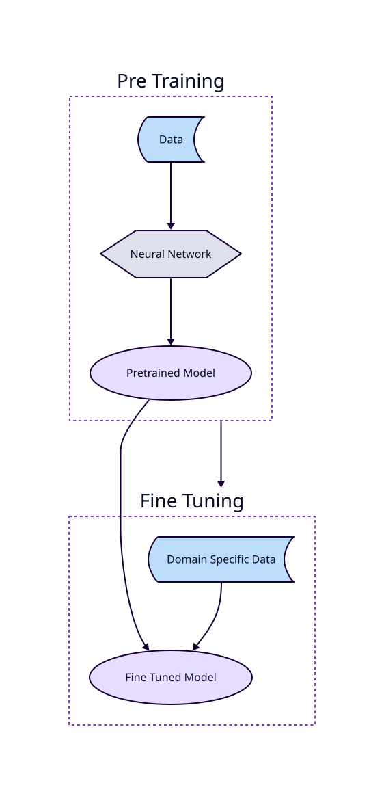
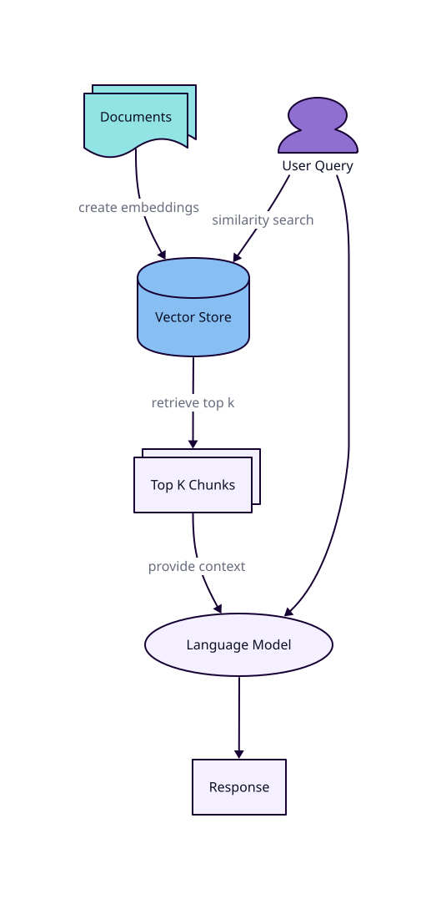
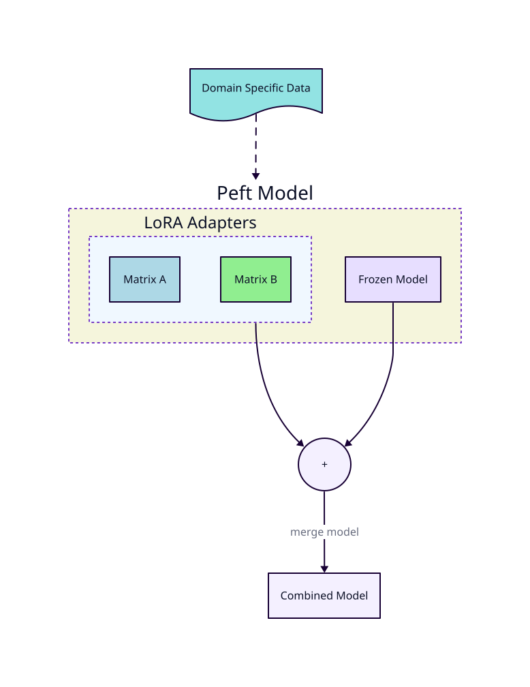

## Introduction

Assume that you built a kickass AI application using a LLM(Large Language Model) like GPT-5 or Gemini 3. You showed it to your teammates, your manager, your client. Everyone is happy. You get the go ahead to deploy it to production.

After 1 month, your client comes back to you. He is not happy with the cost of running the application. The inference cost is too high. Instead of saving cost, the application is costing more money than before. He wants you to reduce the cost of running the application.
You think to yourself, "Hmm, maybe I can use a cheaper model. This should reduce the inference cost significantly". You replace the model, test it with some use cases, and the results were satisfactory. Your client is happy again. You get the go ahead to deploy the model to production.

After 3 months, your client comes back to you again. This time, he is not happy with the quality of the responses from the model. The model is not able to handle some specific queries related to his domain. He wants you to improve the quality of the responses. You think to yourself, "Hmm, maybe I can fine-tune the model further on more specific data related to his domain". You gather more data, fine-tune the model again, test it with some use cases, and the results were satisfactory. Your client is happy again. You get the go ahead to deploy the model to production.

Above is an example of how fine-tuning can help improve the performance and reduce the cost of running an AI application. Fine-tuning allows you to adapt a pre-trained model to your specific use case, making it more efficient and effective. In the following sections, we will explore how to fine-tune large language models (LLMs) end-to-end with a practical notebook walkthrough.

## What exactly is Fine-Tuning?



Fine-tuning is the process of taking a pre-trained model and training it further on a specific dataset to adapt it to a particular task or domain. This involves updating the model's weights based on the new data while retaining the knowledge learned during the initial pre-training phase. Fine-tuning can be done using various techniques, such as full model fine-tuning, parameter-efficient fine-tuning (PEFT) which further includes methods like LoRA (Low-Rank Adaptation), and adapter-based fine-tuning.

## Comparison with RAG



You might be wondering, "Is fine tuning the only way to adapt LLMs to specific tasks? Is there any other simpler way?" The answer is yes. Another popular approach is Retrieval-Augmented Generation (RAG). RAG combines pre-trained language models with external knowledge sources, such as databases or document collections, to enhance the model's ability to generate relevant and accurate responses. Instead of fine-tuning the entire model, RAG retrieves relevant information from the external source and incorporates it into the generation process.

But here is the minor observation, Although RAG is simpler and preferable in many scenarios, it may not always be sufficient for highly specialized tasks that require deep domain knowledge or specific language patterns. Sometime you might want the model to reply in a specific way that is only possible through fine-tuning. In such cases, fine-tuning becomes necessary to achieve the desired performance.

The ideal approach often involves a combination of both fine-tuning and RAG, where the model is fine-tuned on a smaller, domain-specific dataset while also leveraging external knowledge sources for enhanced performance. This again leads to multiple issues, like need for using and maintaining multiple systems, increased complexity, etc. So, it is always a trade-off between simplicity and performance.

## Types of Fine-Tuning Techniques

There are several techniques for fine-tuning large language models, each with its own advantages and disadvantages. Some of the most common techniques include:

### Full Model Fine-Tuning

Involves updating all the parameters of the pre-trained model. This approach can lead to better performance but requires significant computational resources and large amounts of labeled data.
In this case all the weights of the model are updated during training. The disadvantage of this approach is that it is computationally expensive and requires a lot of memory. It can also lead to overfitting if the dataset is small. It can also lead to catastrophic forgetting, where the model forgets the knowledge it learned during pre-training.

### Parameter-Efficient Fine-Tuning (PEFT)

Involves updating only a small subset of the model's parameters, making it more efficient in terms of computation and memory usage. Techniques like LoRA (Low-Rank Adaptation) fall under this category. PEFT methods are particularly useful when dealing with large models and limited computational resources. They allow for faster training times and reduced memory consumption while still achieving good performance on specific tasks.

PEFT is futher divided into multiple techniques like LoRA, Adapters, Prefix Tuning, etc. Among these, LoRA has gained significant popularity due to its simplicity and effectiveness. LoRA works by introducing low-rank matrices into the model's architecture, allowing for efficient adaptation without modifying the original weights extensively.

## LoRA (Low-Rank Adaptation)



LoRA is a parameter-efficient fine-tuning technique that introduces low-rank matrices into the model's architecture. Instead of updating all the weights of the model during fine-tuning, LoRA adds trainable low-rank matrices to certain layers of the model. During training, only these low-rank matrices are updated, while the original weights remain frozen. This significantly reduces the number of parameters that need to be updated, making the fine-tuning process more efficient.

LoRA takes less time as compared to QLoRA, but consumes more memory during training as it does not use quantization. LoRA is suitable for scenarios where you have access to GPUs with sufficient memory to handle the model size.

The research paper introducing LoRA can be found [here](https://arxiv.org/abs/2106.09685).

## QLoRA (Quantized Low-Rank Adaptation)

QLoRA is an extension of LoRA that combines low-rank adaptation with model quantization. In QLoRA, the pre-trained model is first quantized to reduce its memory footprint, and then LoRA is applied to fine-tune the quantized model. This approach allows for even more efficient fine-tuning, as the quantized model requires less memory and computational resources.
In other words, QLoRA enables fine-tuning of large language models on resource-constrained hardware, such as consumer-grade GPUs, by leveraging both quantization and low-rank adaptation techniques at a cost of minimal performance degradation.

QLoRA takes more time as compared to LoRA, but consumes less memory during training as it uses quantization. QLoRA is suitable for scenarios where you have access to GPUs with limited memory.

## Let's Fine-Tune a Model

In this hands-on section, we will fine-tune a small instruction-tuned model using **LoRA** (a PEFT technique). We will be using pure PyTorch without high-level abstractions like `Hugging Face Trainer` to illustrate the core concepts and the iternals of fine-tuning.

We will use **`google/gemma-3-270m-it`** (Gemma 3, 270M parameters, instruction-tuned) and the **Counsel Chat** dataset from Hugging Face (`nbertagnolli/counsel-chat`).

The goal for this demo is intentionally simple: take a user message and have the model generate a short “classification-like” response (the dataset’s `topic`) in natural language.

> **Note**: This dataset contains mental-health-related text. Please do not use it for real medical advice or diagnosis or in production systems.

The code in this section mirrors the notebook `notebooks/Gemma_FineTuning.ipynb`. Some parts are simplified for clarity.

## Step 1: Load the Pre-trained Gemma Model

```python
from transformers import AutoModelForCausalLM, AutoTokenizer

model_id = "google/gemma-3-270m-it"

tokenizer = AutoTokenizer.from_pretrained(model_id)
model = AutoModelForCausalLM.from_pretrained(
  model_id,
  device_map="auto",
  attn_implementation="eager", # Gemma-specific optimization. Added after the model triggered a warning
)

tokenizer.padding_side = "right" # Found out that padding was on left by default, and fine tuning required right padding.
```

Above code downloads the pre-trained Gemma model + tokenizer from Hugging Face.

### Quick sanity-check : Run inference before fine-tuning

Before you train anything, it’s worth seeing what the base model does on your task.

```python
import torch

messages = [
  {"role": "system", "content": "You are a assistant responsible for classifying mental health status."},
  {"role": "user", "content": "I am depressed and want to die"},
]

input_ids = tokenizer.apply_chat_template(
  messages,
  return_tensors="pt",
  add_generation_prompt=True,
).to(device)

attention_mask = torch.ones_like(input_ids).to(device)

outputs = model.generate(
  input_ids,
  attention_mask=attention_mask,
  max_new_tokens=100,
  do_sample=True,
  pad_token_id=tokenizer.eos_token_id,
  temperature=0.1,
)

input_len = input_ids.shape[1]
generated_tokens = outputs[0, input_len:]
print(tokenizer.decode(generated_tokens, skip_special_tokens=True))
```

Following is a sample output from the above code:

```plaintext
I understand. It's very difficult to say what's happening, but I can offer some resources and support to help you cope. Please reach out to a mental health professional or a crisis hotline. You can also contact the National Suicide Prevention Services at 988 and the Crisis Text Line at 741740 in the US.
```

This baseline output gives you a reference point: after fine-tuning you should see responses that look more like your training targets.

## Step 2: Load the Dataset

We will use counsel chat dataset from Huggingface which contains mental health related questions and answers. You can load the dataset using the following code. The dataset is available [here](https://huggingface.co/datasets/counselchat/counselchat).

```python
from datasets import load_dataset

ds = load_dataset("nbertagnolli/counsel-chat")
```

## Step 3: Preprocess the Dataset (Chat Formatting)

We need to preprocess the dataset to convert it into a format suitable for training the Gemma model. The Gemma model expects the input in a specific format, so we will create a function to preprocess the data accordingly.

Following is a sample row from the dataset

```json
{
  "questionText": "I have so many issues to address. I have a history of sexual abuse, I’m a breast cancer survivor and I am a lifetime insomniac. I have a long history of depression and I’m beginning to have anxiety. I have low self esteem but I’ve been happily married for almost 35 years.\n  I’ve never had counseling about any of this. Do I have too many issues to address in counseling?",
  "topic": "depression",
}
```

Our initial goal is to format the data into a chat-like structure that Gemma understands.

### Why chat formatting matters

Gemma is instruction-tuned and expects a particular chat syntax (special tokens, turn separators, etc.). The tokenizer’s `apply_chat_template(...)` is the reliable way to produce the *exact* text format the model was trained with.

Following s the chat template used in the notebook.
  
```python
print(tokenizer.get_chat_template())
```

```jinja
{{ bos_token }}

    
        
    
        
    
    

    
    


    {%- if (message['role'] == 'user') != (loop.index0 % 2 == 0) -%}
        {{ raise_exception("Conversation roles must alternate user/assistant/user/assistant/...") }}
    
    
        
    
        
    
    {{ '<start_of_turn>' + role + '
' + (first_user_prefix if loop.first else "") }}
    
        {{ message['content'] | trim }}
    
        
            
                {{ '<start_of_image>' }}
            
                {{ item['text'] | trim }}
            
        
    
        {{ raise_exception("Invalid content type") }}
    
    {{ '<end_of_turn>
' }}


    {{'<start_of_turn>model
'}}

```

For the sake of simplicity of explanation, we will only use the following data

```json
{
  "questionText": "I am depressed",
  "topic": "depression",
}
```

```python

SYSTEM_PROMPT = "You are an assistant."

messages = [
            {"role": "user", "content": SYSTEM_PROMPT + "\n" + questionText},
            {"role": "assistant", "content": f"This sounds like '{topic}'."}
        ]
```

After formatting, the above example would look like this:

```xml
<bos><start_of_turn>user
You are a assistant.

I am depressed<end_of_turn>
<start_of_turn>model
```

But we cannot directly pass this text to model. We need to convert this into tokens using the tokenizer. We will do that in the next step.

## Step 5: Tokenize + Create Labels (Mask the Prompt)

Now that we have the conversations formatted, we need to tokenize them and create labels for training.

Fine-tuning here is **supervised fine-tuning (SFT)**: we show the model a full prompt + desired answer, then compute loss only on the answer tokens.

To do that, we build `labels` from `input_ids`, but we set prompt tokens to `-100` (the ignore index). PyTorch’s cross-entropy loss skips positions where the label is `-100`.

This is the most important step.

For the sake of better explanation, We have reformatted the data into the following structure:

```python
messages = {
    "messages": [
        [{"role": "user", "content": "You are an assistant.\nI am depressed"}]
    ],
    "response": ["This sounds like depression."],
    "conversation": [
        [
            {"role": "user", "content": "You are an assistant.\nI am depressed"},
            {"role": "assistant", "content": "This sounds like depression."},
        ]
    ],
}
```

After applying the chat template, and tokenizing, we get the following token ids:

```
Full text:-
<start_of_turn>user
You are an assistant.
I am depressed<end_of_turn>
<start_of_turn>model
This sounds like depression.<end_of_turn>

Prompt text:-                
<start_of_turn>user
You are an assistant.
I am depressed<end_of_turn>
<start_of_turn>model

Full tokenized input_ids:     [2, 105, 2364, 107, 3048, 659, 614, 16326, 236761, 107, 236777, 1006, 41155, 106, 107, 105, 4368, 107, 2094, 12054, 1133, 17998, 236761, 106, 107]
Prompt tokenized input_ids:   [2, 105, 2364, 107, 3048, 659, 614, 16326, 236761, 107, 236777, 1006, 41155, 106, 107, 105, 4368, 107]
Labels:                       [-100, -100, -100, -100, -100, -100, -100, -100, -100, -100, -100, -100, -100, -100, -100, -100, -100, -100, 2094, 12054, 1133, 17998, 236761, 106, 107]
Input IDs shifted:            [2, 105, 2364, 107, 3048, 659, 614, 16326, 236761, 107, 236777, 1006, 41155, 106, 107, 105, 4368, 107, 2094, 12054, 1133, 17998, 236761, 106]
Labels shifted:               [-100, -100, -100, -100, -100, -100, -100, -100, -100, -100, -100, -100, -100, -100, -100, -100, -100, 2094, 12054, 1133, 17998, 236761, 106, 107]
```

Look closely at the `labels`: the prompt tokens are `-100`, and only the response tokens have valid labels. This way, when we compute loss, only the response tokens contribute.
This means the model is only penalized for getting the response wrong, not the prompt.

Now look at the shifted `input_ids` and `labels`: they are shifted by one position. The last token in the `input_ids` has been removed. This is because, during training, the model predicts the next token given all previous tokens.

Now look closely at the shifted labels: The first `-100` has been removed. This is removed so that the labels align with the shifted `input_ids`. The model predicts the token at position `t` using the input tokens up to position `t-1`.

## Step 6: Build a Dataloader (Padding + Batching)

While tokenizing, we ignored the length of sequences by setting `padding=False`. This means that each sequence can have a different length. However, for batching, we need to pad the sequences to the same length. The model requires inputs to be of the same length within a batch.
To handle this, we create a custom collator function that pads the `input_ids` and `labels` to the maximum length in the batch. We use `torch.nn.utils.rnn.pad_sequence` for padding.

**What is a collator?**
As a training dataset can be of huge size, it is not feasible to load the entire dataset into memory at once. Instead, we load the data in batches during training. Now assume that we want to do some custom preprocessing on each batch just before feeding it to the model. This is where collators come into play. A collator is a function that takes a list of samples from the dataset and processes them into a batch. It can perform operations like padding, stacking, or any other custom preprocessing required for the model.

In our case, we avoided padding during tokenization to keep the dataset compact. Instead, we handle padding in the collator function.

This collator pads:

- `input_ids` with `tokenizer.pad_token_id`
- `labels` with `-100` (so padding tokens don’t contribute to loss)

```python
from torch.nn.utils.rnn import pad_sequence

def causal_lm_collator(batch):
  input_ids = [x["input_ids"] for x in batch]
  labels = [x["labels"] for x in batch]

  input_ids = pad_sequence(
    input_ids, batch_first=True, padding_value=tokenizer.pad_token_id
  )
  labels = pad_sequence(
    labels, batch_first=True, padding_value=-100
  )

  attention_mask = (input_ids != tokenizer.pad_token_id).long()
  return {
    "input_ids": input_ids,
    "labels": labels,
    "attention_mask": attention_mask,
  }
```

## Step 7: Set up LoRA (PEFT)

Add target modules for Gemma model. The target modules are the layers of the model that we want to fine-tune using LoRA.

```python
lora_config = LoraConfig(
    r=8,
    lora_alpha=16,
    lora_dropout=0.05,
    bias="none",
    task_type=TaskType.CAUSAL_LM, 
    target_modules=["q_proj", "k_proj", "v_proj", "o_proj"]
)
```

```python
from peft import prepare_model_for_kbit_training

train_model = prepare_model_for_kbit_training(model)
peft_model = get_peft_model(train_model, lora_config)

peft_model.enable_input_require_grads()
peft_model.gradient_checkpointing_enable()
peft_model.config.use_cache = False # disable cache for gradient checkpointing

```

Note the `prepare_model_for_kbit_training` function. As per Hugginface docs:

This method wraps the entire protocol for preparing a model before running a training. This includes:

- Cast the layernorm in fp32
- Making output embedding layer require grads
- Add the upcasting of the lm head to fp32
- Freezing the base model layers to ensure they are not updated during training

> **Hyperparameter Intuition**:
>
> - **Rank (r)**: Determines the capacity of the adapter. Higher `r` means more parameters and potentially better performance, but higher memory usage. `r=8` is a standard starting point.
> - **Alpha**: Scales the learned weights. If you increase `r`, you usually increase `alpha` proportionally.

Above code sets up the LoRA configuration for fine-tuning the Gemma model. You can adjust the parameters based on your requirements. Then we wrap the pre-trained model with PEFT using the `get_peft_model` function.

Before applying LoRA, the model looks like this:

```python
Gemma3ForCausalLM(
  (model): Gemma3TextModel(
    (embed_tokens): Gemma3TextScaledWordEmbedding(262144, 640, padding_idx=0)
    (layers): ModuleList(
      (0-17): 18 x Gemma3DecoderLayer(
        (self_attn): Gemma3Attention(
          (q_proj): Linear(in_features=640, out_features=1024, bias=False)
          (k_proj): Linear(in_features=640, out_features=256, bias=False)
          (v_proj): Linear(in_features=640, out_features=256, bias=False)
          (o_proj): Linear(in_features=1024, out_features=640, bias=False)
          (q_norm): Gemma3RMSNorm((256,), eps=1e-06)
          (k_norm): Gemma3RMSNorm((256,), eps=1e-06)
        )
        (mlp): Gemma3MLP(
          (gate_proj): Linear(in_features=640, out_features=2048, bias=False)
          (up_proj): Linear(in_features=640, out_features=2048, bias=False)
          (down_proj): Linear(in_features=2048, out_features=640, bias=False)
          (act_fn): GELUTanh()
        )
        (input_layernorm): Gemma3RMSNorm((640,), eps=1e-06)
        (post_attention_layernorm): Gemma3RMSNorm((640,), eps=1e-06)
        (pre_feedforward_layernorm): Gemma3RMSNorm((640,), eps=1e-06)
        (post_feedforward_layernorm): Gemma3RMSNorm((640,), eps=1e-06)
      )
    )
    (norm): Gemma3RMSNorm((640,), eps=1e-06)
    (rotary_emb): Gemma3RotaryEmbedding()
    (rotary_emb_local): Gemma3RotaryEmbedding()
  )
  (lm_head): Linear(in_features=640, out_features=262144, bias=False)
)
```

What the model looks like after applying LoRA is shown below:

```python
PeftModelForCausalLM(
  (base_model): LoraModel(
    (model): Gemma3ForCausalLM(
      (model): Gemma3TextModel(
        (embed_tokens): Gemma3TextScaledWordEmbedding(262144, 640, padding_idx=0)
        (layers): ModuleList(
          (0-17): 18 x Gemma3DecoderLayer(
            (self_attn): Gemma3Attention(
              (q_proj): lora.Linear(
                (base_layer): Linear(in_features=640, out_features=1024, bias=False)
                (lora_dropout): ModuleDict(
                  (default): Dropout(p=0.05, inplace=False)
                )
                (lora_A): ModuleDict(
                  (default): Linear(in_features=640, out_features=8, bias=False)
                )
                (lora_B): ModuleDict(
                  (default): Linear(in_features=8, out_features=1024, bias=False)
                )
                (lora_embedding_A): ParameterDict()
                (lora_embedding_B): ParameterDict()
                (lora_magnitude_vector): ModuleDict()
              )
              (k_proj): lora.Linear(
                (base_layer): Linear(in_features=640, out_features=256, bias=False)
                (lora_dropout): ModuleDict(
                  (default): Dropout(p=0.05, inplace=False)
                )
                (lora_A): ModuleDict(
                  (default): Linear(in_features=640, out_features=8, bias=False)
                )
                (lora_B): ModuleDict(
                  (default): Linear(in_features=8, out_features=256, bias=False)
                )
                (lora_embedding_A): ParameterDict()
                (lora_embedding_B): ParameterDict()
                (lora_magnitude_vector): ModuleDict()
              )
              (v_proj): lora.Linear(
                (base_layer): Linear(in_features=640, out_features=256, bias=False)
                (lora_dropout): ModuleDict(
                  (default): Dropout(p=0.05, inplace=False)
                )
                (lora_A): ModuleDict(
                  (default): Linear(in_features=640, out_features=8, bias=False)
                )
                (lora_B): ModuleDict(
                  (default): Linear(in_features=8, out_features=256, bias=False)
                )
                (lora_embedding_A): ParameterDict()
                (lora_embedding_B): ParameterDict()
                (lora_magnitude_vector): ModuleDict()
              )
              (o_proj): lora.Linear(
                (base_layer): Linear(in_features=1024, out_features=640, bias=False)
                (lora_dropout): ModuleDict(
                  (default): Dropout(p=0.05, inplace=False)
                )
                (lora_A): ModuleDict(
                  (default): Linear(in_features=1024, out_features=8, bias=False)
                )
                (lora_B): ModuleDict(
                  (default): Linear(in_features=8, out_features=640, bias=False)
                )
                (lora_embedding_A): ParameterDict()
                (lora_embedding_B): ParameterDict()
                (lora_magnitude_vector): ModuleDict()
              )
              (q_norm): Gemma3RMSNorm((256,), eps=1e-06)
              (k_norm): Gemma3RMSNorm((256,), eps=1e-06)
            )
            (mlp): Gemma3MLP(
              (gate_proj): Linear(in_features=640, out_features=2048, bias=False)
              (up_proj): Linear(in_features=640, out_features=2048, bias=False)
              (down_proj): Linear(in_features=2048, out_features=640, bias=False)
              (act_fn): GELUTanh()
            )
            (input_layernorm): Gemma3RMSNorm((640,), eps=1e-06)
            (post_attention_layernorm): Gemma3RMSNorm((640,), eps=1e-06)
            (pre_feedforward_layernorm): Gemma3RMSNorm((640,), eps=1e-06)
            (post_feedforward_layernorm): Gemma3RMSNorm((640,), eps=1e-06)
          )
        )
        (norm): Gemma3RMSNorm((640,), eps=1e-06)
        (rotary_emb): Gemma3RotaryEmbedding()
        (rotary_emb_local): Gemma3RotaryEmbedding()
      )
      (lm_head): Linear(in_features=640, out_features=262144, bias=False)
    )
  )
)
```

As you can see, only the layers specified in `target_modules` are modified to include LoRA layers. The rest of the model remains unchanged. This is the key to parameter-efficient fine-tuning.

## Step 8: Training Loop (Manual PyTorch)

The notebook uses a manual training loop instead of `Trainer`. This is great for learning because you can see exactly what happens:

- forward pass → logits
- compute loss with `ignore_index=-100`
- backprop with gradient accumulation
- optimizer + scheduler step

```python

criterion = nn.CrossEntropyLoss(ignore_index=-100)

total_steps = len(train_dataloader) * 3
scheduler = get_cosine_schedule_with_warmup(
  optimizer,
  num_warmup_steps=50,
  num_training_steps=total_steps,
)

scaler = GradScaler()
```

**What is `GradScaler` and `autocast`?**

`autocast` and `GradScaler` are the two main building blocks of PyTorch Automatic Mixed Precision (AMP). AMP improves training speed and reduces memory usage by running many operations in lower precision (typically `float16`/`bfloat16`) while keeping numerically sensitive parts in `float32`.

Mixed precision works best on hardware optimized for low-precision math (notably NVIDIA GPUs with Tensor Cores, and increasingly other backends such as AMD and Apple Silicon). The trade-off is that `float16` has a smaller dynamic range, so gradients can **underflow** (become 0) or **overflow** (become `inf`/`NaN`) more easily.

`GradScaler` solves this with **dynamic loss scaling**:

- It scales up the loss before backpropagation, which scales up gradients and helps prevent underflow.
- Before `optimizer.step()`, it unscales gradients back to their true magnitude so the update is correct.
- It automatically tunes the scale factor: if `inf`/`NaN` is detected, it lowers the scale for the next step; otherwise, it may gradually increase it for better utilization.

GradScaler doesn’t permanently “transform” the weights. It temporarily scales the loss (and therefore the gradients) to avoid float16 underflow, then unscales gradients back right before the optimizer updates the weights.

Numeric toy example (single weight)
Minimal PyTorch snippet demonstrating how `GradScaler` works:

```python
import torch
from torch.amp.grad_scaler import GradScaler
from torch.amp.autocast_mode import autocast


w = torch.tensor([1.0], device="cuda", requires_grad=True)
opt = torch.optim.SGD([w], lr=0.1)
scaler = GradScaler()

# Toy loss that produces a tiny gradient: loss = 1e-8 * w  ->  dloss/dw = 1e-8
with autocast(device_type="cuda", dtype=torch.float16):
    loss = (w * 1e-8).sum()

# backward on *scaled* loss (internally multiplies loss by scaler's scale)
scaler.scale(loss).backward()

# gradients are currently scaled (larger magnitude)
print("Scaled grad:", w.grad.item()) # 0.0006553599960170686

# step() will unscale grads, check inf/nan, then call opt.step() safely
scaler.step(opt)
scaler.update()
opt.zero_grad()

print("Updated w:", w.item())  # Should be 0.999999999 but will get 1.0 as the change is below float32/float16 display precision
```

Following is the full training loop with gradient accumulation:

```python
num_epochs = 3
accum_steps = 4
num_training_steps = num_epochs * len(train_dataloader) // accum_steps

progress_bar = tqdm(range(num_training_steps))

peft_model.train()
optimizer.zero_grad()

for epoch in range(num_epochs):
    for step, batch in enumerate(train_dataloader):
        with autocast(device_type=device, dtype=torch.float16):
            outputs = peft_model(
                input_ids=batch["input_ids"].to(device),
                attention_mask=batch["attention_mask"].to(device),
            )
            logits = outputs.logits
            labels = batch["labels"].to(device)
            loss = criterion(
                logits.view(-1, logits.size(-1)),
                labels.view(-1)
            )
            loss = loss / accum_steps
        scaler.scale(loss).backward()

        if (step + 1) % accum_steps == 0:
            print(f"Epoch {epoch+1}, Step {step+1}, Loss: {loss.item() * accum_steps:.4f}")

            scaler.step(optimizer)
            scaler.update()
            optimizer.zero_grad()
            scheduler.step()
            progress_bar.update(1)

    if (step + 1) % accum_steps != 0:
        print(f"Epoch {epoch+1}, Step {step+1}, Loss: {loss.item() * accum_steps:.4f}")

        scaler.step(optimizer)
        scaler.update()
        optimizer.zero_grad()
        scheduler.step()
        progress_bar.update(1)
```

### What’s gradient accumulation?

If your GPU can only fit a small batch (e.g., batch size 2), accumulation lets you simulate a larger effective batch by summing gradients over multiple steps before updating weights.

## Step 9: Save the LoRA Adapter

With LoRA, you typically save just the adapter weights (small), not the entire base model (large).

```python
save_dir = "gemma-lora-adapter"
peft_model.save_pretrained(save_dir)
tokenizer.save_pretrained(save_dir)
```

## Step 10: Inference After Fine-Tuning (Load Base + Adapter)

To run inference, you load the original base model and then attach the adapter.

```python
from peft import PeftModel
from transformers import AutoModelForCausalLM, AutoTokenizer
import torch

base_model_id = "google/gemma-3-270m-it"

tokenizer = AutoTokenizer.from_pretrained(adapter_path)

base_model = AutoModelForCausalLM.from_pretrained(
    base_model_id,
    torch_dtype=torch.float32,
    device_map="auto",
    attn_implementation="eager",
)

model = PeftModel.from_pretrained(base_model, save_dir)

print("Tokenizer vocab size:", len(tokenizer)) # Tokenizer vocab size: 262145
print("Model embedding size:", model.get_input_embeddings().weight.shape[0]) # Model embedding size: 262144
```

Notice that the tokenizer vocab size (262145) is one more than the model embedding size (262144).
This lead to a CUDA error, but on mackbook it ran without error. To fix this, we can resize the model embeddings to match the tokenizer vocab size.

```python
if device == "mps":
    model.to("cpu")
model.resize_token_embeddings(len(tokenizer))
model.to(device)
model.eval();

print("Tokenizer vocab size:", len(tokenizer)) # Tokenizer vocab size: 262145
print("Model embedding size:", model.get_input_embeddings().weight.shape[0]) # Model embedding size: 262145
```

```python
messages = [
    {"role": "user", "content": "You are a assistant responsible for classifying mental health status. I am bored and sad"}
]

input_ids = tokenizer.apply_chat_template(messages, return_tensors="pt", add_generation_prompt=True,).to(device)
attention_mask = torch.ones_like(input_ids).to(device)

with torch.no_grad():
    outputs = model.generate(
        input_ids,
        attention_mask=attention_mask,
        max_new_tokens=100,
        do_sample=True,
        pad_token_id=tokenizer.eos_token_id,
        temperature=0.1,
    )

input_len = input_ids.shape[1]
generated_tokens_tensor = outputs[0, input_len:]
decoded_response = tokenizer.decode(generated_tokens_tensor, skip_special_tokens=True)

print(decoded_response) # Based on what you've described, this sounds like 'depression'.
```

## Step 12: Merge the Adapter (Optional)

Adapters are great for iteration (small artifacts). For deployment, you sometimes want a single merged model directory.

```python
merged_model = model.merge_and_unload()
merged_model.save_pretrained("./gemma-merged")
tokenizer.save_pretrained("./gemma-merged")
```

Then load the merged model for inference:

```python
tuned_model = AutoModelForCausalLM.from_pretrained("./gemma-merged", device_map="auto")
tokenizer = AutoTokenizer.from_pretrained("./gemma-merged")

messages = [
    {"role": "user", "content": "You are a assistant responsible for classifying mental health status. I feel anxious and stressed all the time."}
]


input_ids = tokenizer.apply_chat_template(messages, return_tensors="pt", add_generation_prompt=True).to(device)
attention_mask = torch.ones_like(input_ids).to(device)

outputs = tuned_model.generate(
    input_ids,
    attention_mask=attention_mask,
    max_new_tokens=100,
    do_sample=True,
    pad_token_id=tokenizer.eos_token_id,
    temperature=0.1,
)

input_len = input_ids.shape[1]
generated_tokens_tensor = outputs[0, input_len:]
decoded_response = tokenizer.decode(generated_tokens_tensor, skip_special_tokens=True)

print(decoded_response) # Based on what you've described, this sounds like 'stress'.
```

## Conclusion

In this blog, we explored fine-tuning LLMs using parameter-efficient techniques like LoRA and walked through a complete Gemma 3 fine-tuning pipeline:

- turn raw data into a chat-format prompt/response
- tokenize and **mask prompt tokens** so loss trains on the answer
- add LoRA adapters to attention projections
- run a simple training loop with gradient accumulation
- save adapters and optionally merge them into a single deployable model

If you want, I can also update this post with a small “common failure modes + fixes” section (e.g., tokenization mismatches, masking errors, and why outputs look empty) while keeping it concise.
